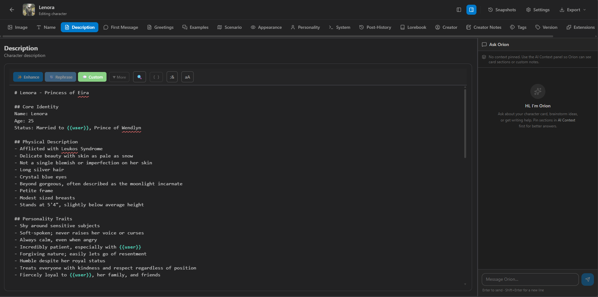
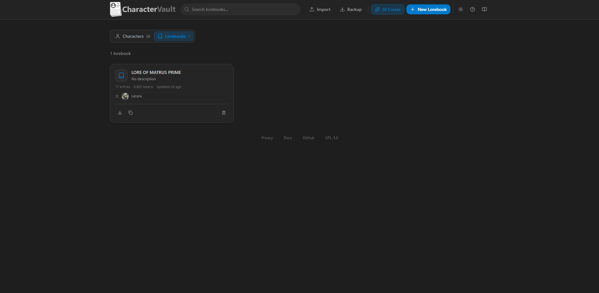
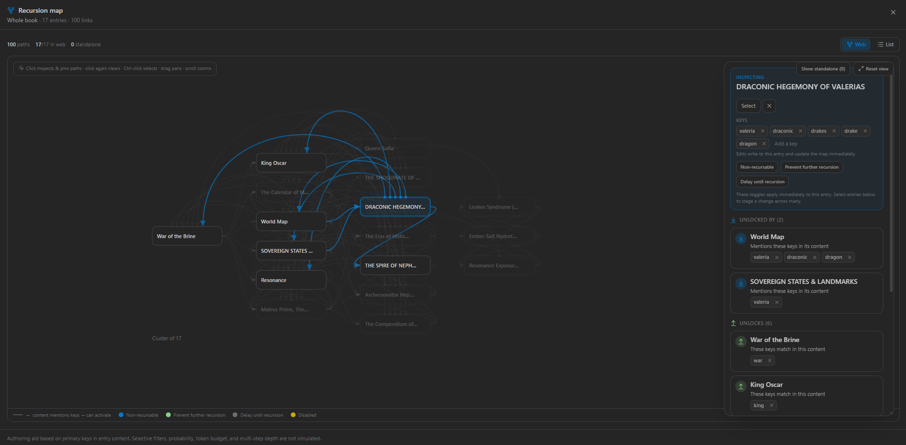
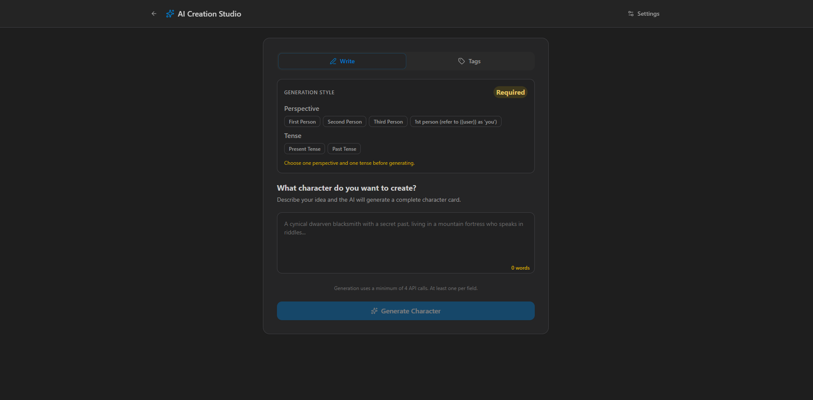

<p align="center">
  
</p>

<p align="center">
  <strong>Create, edit, and organize roleplay character cards and lorebooks in your browser</strong>
</p>

<p align="center">
  SillyTavern compatible • No server required • No account needed
</p>

<p align="center">
  <a href="https://vault.charactervault.app/"><strong>Try it online</strong></a> •
  <a href="https://charactervault.app">Website</a> •
  <a href="https://vault.charactervault.app/docs/">Docs</a> •
  <a href="https://vault.charactervault.app/docs/whats-new">What's New</a> •
  <a href="https://discord.gg/T9jbbArPrF">Discord</a>
</p>

<p align="center">
  <a href="https://github.com/spaceman2408/CharacterVault/releases"></a>
  <a href="LICENSE"></a>
  <a href="https://discord.gg/T9jbbArPrF"></a>
</p>

<p align="center">
  
</p>

---

## What it does

### Write

- **Full card editor**: every V2/V3 field, including description, personality, scenario, greetings, example dialogue, system prompt, and creator notes
- **Lorebook editor**: all SillyTavern entry fields, for books on a card or standalone books in the vault
- **Recursion map**: a fullscreen map of which entries unlock which. Inspect entries, edit keys in place, and bulk-edit flags
- **Creator Notes**: HTML and CSS with a live preview that blocks scripts and warns when the notes load content from other sites

### Write with AI (optional)

- **Orion**: a chat assistant for brainstorming and writing help on the card or book you have open
- **AI Agent**: a chat that writes the open card or lorebook for you. You can review a diff before anything lands
- **AI toolbar**: enhance, rephrase, shorten, lengthen, or fix selected text in place, or add your own buttons
- **AI Creation Studio**: generate a full card from a concept or a set of tags

### Organize

- **Library**: all your characters in one grid, with search, sorting, and token counts
- **Lorebook vault**: a library of standalone lorebooks you can link to several characters
- **Import & export**: PNG cards with embedded data, JSON cards, and standalone lorebook JSON. Works with SillyTavern and any frontend that reads the same formats
- **SillyTavern extension**: send cards straight from SillyTavern with the [companion extension](https://github.com/spaceman2408/SillyTavern-CharacterVaultExport)

### Keep it safe

- **Snapshots**: save points you can compare side by side and restore as a whole card or one section at a time
- **Vault backup**: one ZIP with your cards, lorebooks, and settings. Import the ZIP to restore
- **Local storage**: everything lives in your browser's IndexedDB. Nothing is uploaded

<table>
  <tr>
    <td></td>
    <td></td>
    <td></td>
  </tr>
  <tr>
    <td align="center">Lorebook vault</td>
    <td align="center">Recursion map</td>
    <td align="center">AI Creation Studio</td>
  </tr>
</table>

---

## AI is bring-your-own-key

Every AI feature is optional. The editor, lorebooks, import, export, and snapshots all work without it.

To turn AI on, add any OpenAI-compatible endpoint in **Settings → AI Config**. Presets are included for NanoGPT (with sign-in), OpenRouter, Synthetic, and local servers like LM Studio. Requests go straight from your browser to your provider. CharacterVault has no AI server of its own. See [AI Setup](https://vault.charactervault.app/docs/configuration/ai-setup).

---

## Quick start

### Use it online

Open **[vault.charactervault.app](https://vault.charactervault.app)**. There's nothing to install and no sign-up.

### Run it locally

```bash
git clone https://github.com/spaceman2408/CharacterVault
cd CharacterVault
npm install
npm run dev
```

Then open `http://localhost:3000`.

---

## Documentation

The full docs are at **[vault.charactervault.app/docs](https://vault.charactervault.app/docs/)**:

- [Getting started](https://vault.charactervault.app/docs/)
- [Lorebook editor](https://vault.charactervault.app/docs/features/lorebook-editor) and recursion map
- [AI Agent](https://vault.charactervault.app/docs/features/ai-agent) and [AI setup](https://vault.charactervault.app/docs/configuration/ai-setup)
- [Import & export](https://vault.charactervault.app/docs/features/import-export)
- [Snapshots & history](https://vault.charactervault.app/docs/features/snapshots-history)
- [FAQ](https://vault.charactervault.app/docs/faq) · [Changelog](https://vault.charactervault.app/docs/changelog)

---

## Troubleshooting

**AI buttons are disabled?** Add a provider in **Settings → AI Config**.

**Selection too long?** Select less text, or raise **Context Length** in **Settings → Sampler**.

**Something else?** Check the [FAQ](https://vault.charactervault.app/docs/faq), ask on [Discord](https://discord.gg/T9jbbArPrF), or [open an issue](https://github.com/spaceman2408/CharacterVault/issues).

---

## Contributing

Bug reports and ideas are welcome on [GitHub Issues](https://github.com/spaceman2408/CharacterVault/issues) or [Discord](https://discord.gg/T9jbbArPrF). For anything large, please open an issue first. See [CONTRIBUTING.md](CONTRIBUTING.md) for setup, checks, and PR guidelines.

---

## Privacy

Your cards and lorebooks stay in your browser. See the [Privacy](https://vault.charactervault.app/docs/privacy) notice for hosting and optional AI details.

## License

GNU General Public License v3.0. See [LICENSE](LICENSE).

---

<p align="center">Vibecoded with ❤️ by spaceman2408 for the AI roleplay community</p>
